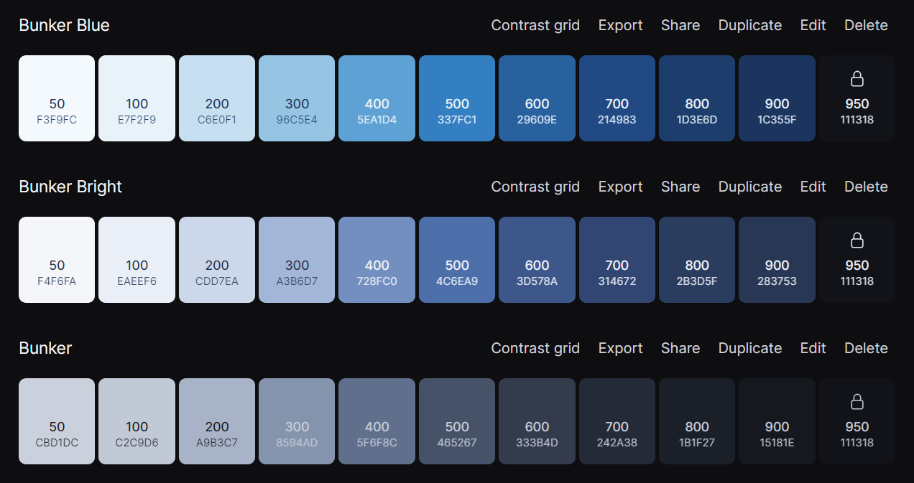

# Esce Theme for VS Code
## Installation
1. Go to [VS Marketplace](https://marketplace.visualstudio.com/items?itemName=dmatuwidi.esce) page for the theme
2. Press "Install"
## Contribute
1. Clone this repository and open it in VS Code
2. Press `F5` to open a new extension debug window
3. Make changes to the `/theme/Esce-color-theme.json` file.
4.  Once finished, commit your changes and open a pull request
 

If possible, refer to this basic colour scheme  
